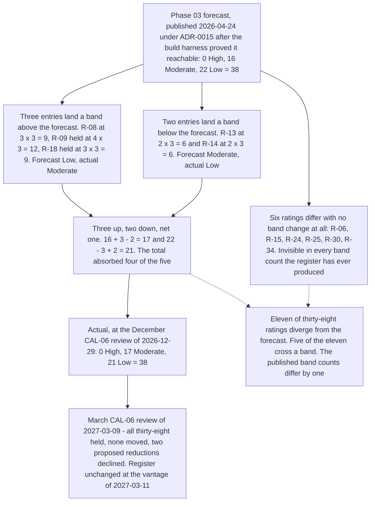

# Diagram — Forecast Against Actual

| Field | Value |
|---|---|
| Document ID | CNB-TRUST-2027-D34 |
| Version | 1.0 |
| Date | 2027-03-11 |
| Owner | Karim Haddad |
| Approver | Rahul Bhargava |
| Classification | Confidential — Trust &amp; Assurance Programme // Illustrative Portfolio Sample |

## The arithmetic

| Band | Forecast | Actual at 2026-12-29 | At 2027-03-09 | Difference against forecast |
|---|---|---|---|---|
| High | 0 | 0 | 0 | — |
| Moderate | 16 | **17** | **17** | **+1** |
| Low | 22 | **21** | **21** | **−1** |
| **Total** | **38** | **38** | **38** | — |

0 + 16 + 22 = 38. 0 + 17 + 21 = 38. **The forecast provided for two additions on evidence and two arrived**
— R-37 on 2026-05-22 and R-38 on 2026-10-23 — which is the only part of the population forecast that was
exactly right for exactly the reason it was made.

## The eleven divergences, and what each is

| Entry | Forecast | Actual | Band moved? | Error, event or neither |
|---|---|---|---|---|
| R-06 | 2 × 4 = 8 | 3 × 4 = 12 | No | **Error** — the forecast assumed the entry would reach likelihood 2; the review moved one step on 65 nights of `CNB-C-149` |
| R-08 | 2 × 3 = 6 | 3 × 3 = 9 | **Yes** | **Event** — nine occurrences in ninety-two days took it to likelihood 5 in September |
| R-09 | 2 × 3 = 6 | 4 × 3 = 12 | **Yes** | **Event** — 2 of 40 provisioning requests, tested in full; the entry did not move at all |
| R-13 | 3 × 3 = 9 | 2 × 3 = 6 | **Yes** | **Error, in the other direction** — the forecast reasoned about the yield of a phish when the control had changed the path |
| R-14 | 3 × 3 = 9 | 2 × 3 = 6 | **Yes** | **Neither** — moved on `CNB-C-111`, a basis the forecast did not contemplate; the forecast's own reasoning was not overturned |
| R-15 | 2 × 2 = 4 | 3 × 2 = 6 | No | **Error** — same cause as R-06 |
| R-18 | 2 × 3 = 6 | 3 × 3 = 9 | **Yes** | **Event** — the Severity-1 of 2026-09-08 |
| R-24 | 2 × 4 = 8 | 3 × 4 = 12 | No | **Event** — forecast as immovable on the floor, it moved **upward** on 2026-10-28 |
| R-25 | 2 × 2 = 4 | 3 × 2 = 6 | No | **Error** — same cause as R-06 |
| R-30 | 2 × 2 = 4 | 3 × 2 = 6 | No | **Event** — `NC-INT-01` and `MIN-01`, twice |
| R-34 | 2 × 2 = 4 | 3 × 2 = 6 | No | **Error** — clean evidence and no reduction proposed, because the entry was already Low |

**Five events, five errors and one that is neither.** The five errors share a single cause: **the forecast
modelled treatment completion and the December review modelled evidence.** Four stopped short of the
forecast and one overshot it, which is why the finding is that the method erred in both directions rather
than that the forecast was optimistic.

## Three properties of this comparison worth naming

**The aggregate cancels, and that is its designed behaviour rather than a fault in this register.** Three
entries landing a band high and two landing a band low produce a net difference of one. Any programme that
publishes a close forecast in bands and marks it in bands will get the same reassuring answer whatever
happened underneath, and the eleven-to-one ratio is the measurement that says so.

**The part of the forecast that came from a rule was right and the part that came from a judgement was
wrong eleven times.** The **twelve entries with impact 4 or 5** that 03.02 §5.3 identified in advance as
incapable of ever being rated Low behaved exactly as the floor rule said they would; the two immovables at
2 × 5 = 10 did not move; likelihood 1 was never used. **The rules held on every one of thirty-eight rows.**

**And the March review is on this diagram deliberately.** A comparison that stopped at the December position
would imply the register's close is a fixed point. It is not: 2027-03-09 tested all thirty-eight entries
against the same movement rules, moved none, declined two proposed reductions, and recorded why. **The first
review of a new cycle has nothing to move on**, and `IS-37` exists because the same sentence is available at
the next three reviews of a twelve-month window.

## What this diagram does not show

**It does not show treatment.** TP-01 to TP-34 sit underneath every transition on the forecast side and none
appears, because a rating moves on evidence of what happened rather than on a completed treatment item —
which is precisely the assumption that produced five of the eleven divergences.

**It does not show closures, because there are none.** Thirty-eight entries, two additions on evidence,
nothing ever closed and nothing ever removed. **ADR-0045** records that the close-out did not change that.

**And it does not show anything about the examination.** No rating here appears in Section IV, no divergence
is a deviation, and nothing on this diagram is a statement about whether any applicable trust services
criterion was achieved.

## Cross-References

| Document | Relationship |
|---|---|
| [09.10 The Register at Close — Forecast Against Actual](../09.10-the-register-at-close-forecast-against-actual.md) | §3's five, §5's six and §6's error-or-event classification in full |
| [09.12 Continuous Assurance and the Board Report](../09.12-continuous-assurance-and-the-board-report.md) | `IS-37` and the twelve-month window |
| [governance/GOV-35](../governance/GOV-35-march-cal-06-register-review.md) | The March review at entry level |
| [adr/ADR-0045](../adr/ADR-0045-nothing-is-closed-to-make-the-close-out-tidy.md) | Why nothing closed |
| [logs/raid-log.md](../logs/raid-log.md) | `IS-37`, and the register position carried forward |
| [03.07 Risk Acceptance and Residual Risk](../../03-risk-assessment-treatment-and-statement-of-applicability/03.07-risk-acceptance-and-residual-risk.md) | The forecast, its per-entry derivation, ADR-0015 and §7's instruction |
| [03.02 Risk Criteria and Scoring Scale](../../03-risk-assessment-treatment-and-statement-of-applicability/03.02-risk-criteria-and-scoring-scale.md) | The anchors, the reserved likelihood 1 and the eight floor |
| [03.04 Risk Register — Baseline](../../03-risk-assessment-treatment-and-statement-of-applicability/03.04-risk-register-baseline.md) | The thirty-six entries the forecast was derived from |
| [diagrams/08-the-register-from-baseline-to-close.md](../../08-internal-audit-certification-and-type-ii-examination/diagrams/08-the-register-from-baseline-to-close.md) | Baseline to close, the line this comparison is drawn against |
| [governance/GOV-32](../../08-internal-audit-certification-and-type-ii-examination/governance/GOV-32-december-cal-06-register-review.md) | The December review that produced the actual |
