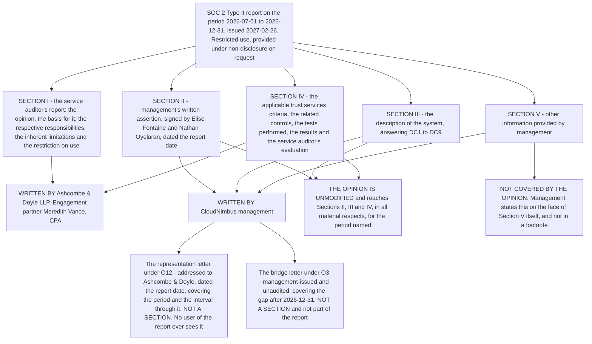

# Diagram — The Five Sections and Who Writes Them

| Field | Value |
|---|---|
| Document ID | CNB-TRUST-2027-D33 |
| Version | 1.0 |
| Date | 2027-03-11 |
| Owner | Rahul Bhargava |
| Approver | Karim Haddad |
| Classification | Confidential — Trust &amp; Assurance Programme // Illustrative Portfolio Sample |

## The five sections, their authors and what the opinion reaches

| Section | Contents | Author | Reached by the opinion? |
|---|---|---|---|
| **I** | The opinion, the basis for it, the responsibilities of management and of the practitioner, the inherent limitations, and the paragraph restricting use | **Ashcombe &amp; Doyle LLP** | It **is** the opinion |
| **II** | Management's written assertion, in the three limbs `09.01` §2 sets out | **CloudNimbus management** | **Yes** |
| **III** | The description of the system — DC1 to DC8 at `09.02`, DC9 at `09.03` | **CloudNimbus management** | **Yes** |
| **IV** | For each applicable criterion: the controls management states meet it, the tests performed, the results, and the evaluation of any deviation | **Ashcombe &amp; Doyle LLP** | **Yes** |
| **V** | The Stage 2 major nonconformity and its closure, the ISO/IEC 27001:2022 certificate, and the two ISO reissues | **CloudNimbus management** | **No** |

**Three authors, and the middle one is the whole difficulty.** Management writes Sections II, III and V; the
service auditor writes Sections I and IV; **and the sections alternate.** A reader working through the
document front to back changes author four times, with nothing but a heading to mark it.

## The two crossings a reader gets wrong

**Section III and Section IV.** The description states what a control **is**; Section IV states what was
**tested**, on what population, and what was **found**. `09.06` §1 owns that distinction. **A portfolio that
blurs the two has misunderstood the document**, and the practical consequence is visible in the nine
exceptions: `CNB-C-082` is described in Section III as an emergency change approval control, and it is in
Section IV that the population reads fifteen and the deviations read two.

**Section IV and Section V.** `MAJ-01` is a clause 9.2 nonconformity. Clause 9.2 has no trust services
criterion and `CNB-C-146` is ISO-only, so it appears in no criterion's control set — **and a control that is
not in Section IV cannot have a deviation reported in Section IV.** It is in Section V, where the opinion
does not reach, and management says so on the face of the section. **"Nonconformity" is ISO and "exception"
or "deviation" is SOC 2**, and calling `MAJ-01` an exception is a single word that produces a document
saying something untrue about which independent party concluded what.

## The two instruments that are not sections at all

| Instrument | What it is | Who sees it |
|---|---|---|
| **The representation letter**, under **O12** | Management's statement to the practitioner: all known noncompliance, all knowledge of fraud, all deficiencies of which management is aware, and all subsequent events. **Two were represented** — `CNB-C-150` on 2027-01-08 and the certificate on 2027-01-22 | **Ashcombe &amp; Doyle only.** No user of the report ever sees it |
| **The bridge letter**, under **O3** | Management-issued and unaudited. No practitioner opinion, no tests, no assurance. It states what management is aware of in the gap after the period end. **Nine were issued** | The requesting customer |

**Conflating the assertion with the representation letter is the commonest error in describing a SOC 2
engagement.** They are signed by the same two officers on the same day; that is the only thing they share.
**The assertion goes in the report and the reader sees it; the representation letter goes to the
practitioner and the reader never does.**

## Cross-References

| Document | Relationship |
|---|---|
| [09.04 The Report and the Opinion](../09.04-the-report-and-the-opinion.md) | The chapter this diagram belongs to; the three limbs and the four opinion forms |
| [09.01 Management's Assertion and the Representation Letter](../09.01-managements-assertion-and-the-representation-letter.md) | The two instruments at the foot of the diagram, held apart |
| [09.02 The Description of the System](../09.02-the-description-of-the-system.md) | Section III and DC1 to DC8 |
| [09.06 Section IV and the Nine Exceptions as Published](../09.06-section-iv-and-the-nine-exceptions-as-published.md) | Section IV, and who writes it |
| [09.07 Section V and What the Opinion Does Not Cover](../09.07-section-v-and-what-the-opinion-does-not-cover.md) | Section V, and the statement on its own face |
| [09.09 The Bridge Letter](../09.09-the-bridge-letter.md) | The instrument in the last row of the last table |
| [diagrams/09-what-each-document-covers-and-does-not.md](09-what-each-document-covers-and-does-not.md) | The same four instruments, by what each covers |
| [08.12 The Scheduling Collision](../../08-internal-audit-certification-and-type-ii-examination/08.12-the-scheduling-collision.md) | The structural elimination that sent `MAJ-01` to Section V |
| [01.02 SOC 2 Landscape and Trust Services Criteria](../../01-program-foundation-dual-framework-governance/01.02-soc-2-landscape-and-trust-services-criteria.md) | The five sections and restricted use, as stated at chartering |
