# Diagram — The Programme End to End

| Field | Value |
|---|---|
| Document ID | CNB-TRUST-2027-D35 |
| Version | 1.0 |
| Date | 2027-03-11 |
| Owner | Rahul Bhargava |
| Approver | Karim Haddad |
| Classification | Confidential — Trust &amp; Assurance Programme // Illustrative Portfolio Sample |

```mermaid
flowchart TD
    KICK["2026-01-19, MS-01 - board approves the envelope and charters the programme. ADR-0001 to ADR-0005 taken at chartering, including the decision to hold Stage 2 inside the observation window"]
    SCOPING["2026-02 to 2026-03 - SOC 2 system scope, ISMS boundary at the whole organisation, asset inventory, data flows. Neither boundary contains the other"]
    RISKSOA["2026-03 to 2026-04 - risk assessment, treatment plan and Statement of Applicability. MS-04 on 04-10 and MS-05 on 04-24. Baseline 36 entries: 7 High, 17 Moderate, 12 Low"]
    FCAST["2026-04-24 - close forecast published under ADR-0015, only after the harness proved it reachable: 0 High, 16 Moderate, 22 Low = 38"]
    BUILD["2026-04 to 2026-06 - unified control library, 19 policies, control implementation"]
    PENT["2026-05-04 to 05-22 - penetration testing. 16 findings, 1 Critical: a tenant isolation flaw. R-37 admitted 05-22, remediated 05-29, retested clean 06-11, before the window opened"]
    ISMSOP["2026-06-15, MS-09 - ISMS declared operational"]
    WOPEN["2026-07-01, MS-10 - Type II observation window opens. 184 days"]
    DREX["2026-08-19, MS-11 - disaster recovery exercise. RTO 2h51m against 4h; eu-central-1 deliberately not failed over under O8"]
    SEV1["2026-09-08 - Severity-1, 71 minutes. SC-01 missed in September for the 599 served from us-east-1 and met for the 41 served from eu-central-1. FAILURE TWO: the probe measured a read"]
    IAUD["2026-09-14 to 09-25, MS-12 - clause 9.2 internal audit. 2 minor nonconformities, 9 opportunities, and a scope note recommending clauses 4 to 10 and one region be reconsidered"]
    MREV["2026-09-30, MS-13 - clause 9.3 management review. The scope note presented at input d) 3) and the deferral confirmed"]
    STG1["2026-10-12 to 10-14, MS-14 - ISO Stage 1. 0 nonconformities, 6 areas of concern"]
    RT02["2026-10-23 - the RT-02 deletion job found to have addressed an emptied relation for 68 consecutive nights. R-38 admitted. FAILURE ONE: a control whose condition is that a record was written"]
    STG2["2026-11-30 to 12-04, MS-15 - ISO Stage 2. 1 major, 4 minor, 7 opportunities. MAJ-01 raised 12-02, twenty-nine days before the window closed. FAILURE FOUR: the library got ahead of the practice"]
    DECREV["2026-12-29 - December CAL-06 review. Nineteen entries move, seven held, twelve already-Low unchanged. Leaving 38: 0 High, 17 Moderate, 21 Low"]
    WSHUT["2026-12-31, MS-16 - observation window closes. FAILURE THREE stands in the record: the August restore test, not re-performed and not back-dated"]
    FIELD["2027-01-12 to 02-05 - Type II fieldwork. Nine test exceptions, every one found by CloudNimbus first. On 01-28 the engagement team raises the possible modification on exception 5"]
    MAJCL["2027-01-15 - major nonconformity verified closed, forty-four days from the finding of 2026-12-02. Certification decision 2027-01-20"]
    CERT["2027-01-22, MS-17 - ISO/IEC 27001:2022 certificate issued by Northgate Certification Services, valid to 2030-01-21"]
    REPT["2027-02-26, MS-18 - report issued. Unmodified opinion, nine exceptions disclosed in Section IV, the collision and the certificate in Section V. Assertion and representation letter under O12 the same day"]
    DIST["2027-03-06 - restricted-use distribution complete under O2. 118 enterprise-tier deliveries, plus 37 of 522 on request under O1"]
    MARREV["2027-03-09 - March CAL-06 review. All thirty-eight held, none moved, two proposed reductions declined"]
    BOARD["2027-03-11 - board and Audit and Risk Committee report. Seven objectives met, OBJ-03 missed at 16.9 per cent against 70, sixteen corrective actions open and none closed"]
    NEXT["Scheduled, and not outcomes: the 2027 observation window runs 2027-01-01 to 2027-12-31 and is ten weeks old; the first surveillance audit is scheduled for 2027-11 under O11; recertification falls in year three"]

    KICK --> SCOPING
    SCOPING --> RISKSOA
    RISKSOA --> FCAST
    RISKSOA --> BUILD
    BUILD --> PENT
    PENT --> ISMSOP
    ISMSOP --> WOPEN
    WOPEN --> DREX
    DREX --> SEV1
    SEV1 --> IAUD
    IAUD --> MREV
    MREV --> STG1
    STG1 --> RT02
    RT02 --> STG2
    STG2 --> DECREV
    DECREV --> WSHUT
    WSHUT --> FIELD
    STG2 --> MAJCL
    MAJCL --> CERT
    FIELD --> REPT
    CERT --> REPT
    REPT --> DIST
    DIST --> BOARD
    MARREV --> BOARD
    FCAST -.-> MARREV
    BOARD -.-> NEXT
```

## Fourteen months, in figures

| Item | Figure |
|---|---|
| Programme duration | **2026-01-19 to 2027-03-11**, approximately fourteen months |
| Observation window | **2026-07-01 to 2026-12-31**, 184 days |
| Controls in the unified library | **150** — **113 dual-serving · 21 SOC 2-only · 16 ISO-only** |
| Trust services criteria in scope | **61**, of which **9 carry an exception and 52 carry none** — A1.1, A1.2, PI1.3, CC8.1, P4.2, CC9.2, P5.1, CC6.2 and CC6.3 |
| Annex A controls considered | **93** — **91 determined necessary**, **2 determined not necessary** and excluded in the Statement of Applicability |
| Risk register | **38 entries** at close, from a baseline of 36 — **2 added on evidence, none closed, none removed** |
| Decisions | **116**, DEC-101 to DEC-915 |
| Architectural decision records | **45**, ADR-0001 to ADR-0045 |
| Governance records | **36**, GOV-01 to GOV-36 |
| Evidence artefacts | **2,103**, from one shared store, **356 of them serving both audits** |
| Committed spend | **$1,366,000** against a **$1,400,000** envelope |
| Resourcing | **4.6 FTE-equivalents** |
| Phases | **9** — Phase 01 re-issued once, Phase 02 once, Phase 04 three times |

## The four failures, marked on the line

| Failure | Where it sits | What it taught |
|---|---|---|
| **RT-02** — a deletion job addressed an emptied relation for 68 nights, reporting success and deleting nothing | Found 2026-10-23, inside the window | A control whose operating condition is **that a record was written**, rather than what the record says. `IS-33` still owes the enumeration |
| **`CNB-C-096`** — the availability probe performed a read, so no burn registered against the error budget through 71 minutes in which writes failed | 2026-09-08, inside the window | A control that says **how often** and never says **what**. `CNB-C-068` beside it was explicit, which is what makes it a design deficiency rather than an inevitability |
| **The missed restore test** — `CNB-C-098`'s August occurrence did not happen | 2026-08, found 2026-09-14 | **A correction that fixes the instances is not a corrective action**, and clause 10.2 says so in words. Not re-performed, not back-dated, 5 of 6 stands |
| **`MAJ-01`** — the internal audit programme did not cover clauses 4 to 10 or `eu-central-1` | Raised 2026-12-02, written down January 2026 | The library got ahead of the practice it described, and **reading the library told nobody anything was wrong**. `IS-35` records the class rather than the instance |

**Of the four: one is an exception and not a nonconformity — `D-06-02`, `CNB-C-096`; one is a nonconformity
and not an exception — `MAJ-01`; and two are both — `D-06-01`, the missed restore test, and `D-07-01`,
RT-02.** 08.12 §5 sets out the four worked cases and the finding log carries the classification column that
keeps the two vocabularies apart.

## What this diagram does not show

**It does not show anything after 2027-03-11 as an outcome.** The `NEXT` node is scheduled work: a window
ten weeks old with no complete population for any control, an audit on a calendar, and a recertification in
year three. **Nothing on the far side of the dotted line has happened.**

**It does not show the corrective actions.** Sixteen are open at the last node on the line, none is closed,
and a timeline that ended at a board meeting would suggest otherwise. 09.12 §2 carries them.

**And it does not show the re-issues in place.** Phase 01 was re-issued once, Phase 02 once and Phase 04
three times, each because an amendment was made **at source** rather than corrected downstream. Those
re-issues have no date on this line because they are corrections to documents rather than events in the
programme — and **a library that corrects itself silently cannot demonstrate that it was ever wrong**, which
is why they are counted at all.

## Cross-References

| Document | Relationship |
|---|---|
| [09.11 The Programme Against Its Objectives](../09.11-the-programme-against-its-objectives.md) | §5, the programme in figures |
| [09.12 Continuous Assurance and the Board Report](../09.12-continuous-assurance-and-the-board-report.md) | The next cycle, and the sixteen open corrective actions |
| [09.13 What This Portfolio Claims and What It Does Not](../09.13-what-this-portfolio-claims-and-what-it-does-not.md) | §3, the four failures and what each taught |
| [diagrams/09-forecast-against-actual.md](09-forecast-against-actual.md) | The forecast node and the March review node, in detail |
| [logs/obligation-register.md](../logs/obligation-register.md) | O1, O2, O8, O11 and O12, which shape five of these nodes |
| [governance/GOV-36](../governance/GOV-36-board-and-audit-risk-committee-report.md) | The last node on the line |
| [01.12 Programme Roadmap and Milestones](../../01-program-foundation-dual-framework-governance/01.12-program-roadmap-and-milestones.md) | MS-01 to MS-18 as planned in January 2026 |
| [08.12 The Scheduling Collision](../../08-internal-audit-certification-and-type-ii-examination/08.12-the-scheduling-collision.md) | Stage 2 inside the window, accepted at chartering in ADR-0005 |
| [diagrams/08-the-assurance-calendar-as-it-actually-ran.md](../../08-internal-audit-certification-and-type-ii-examination/diagrams/08-the-assurance-calendar-as-it-actually-ran.md) | CAL-01 to CAL-16 against the same fourteen months |
| [07.03 The RT-02 Retention Failure](../../07-confidentiality-privacy-and-third-party-assurance/07.03-the-rt-02-retention-failure.md) | Failure one, in full |
| [06.05 The Severity-1 Incident of 2026-09-08](../../06-availability-processing-integrity-and-operations/06.05-the-severity-1-incident-of-2026-09-08.md) | Failure two, in full |
