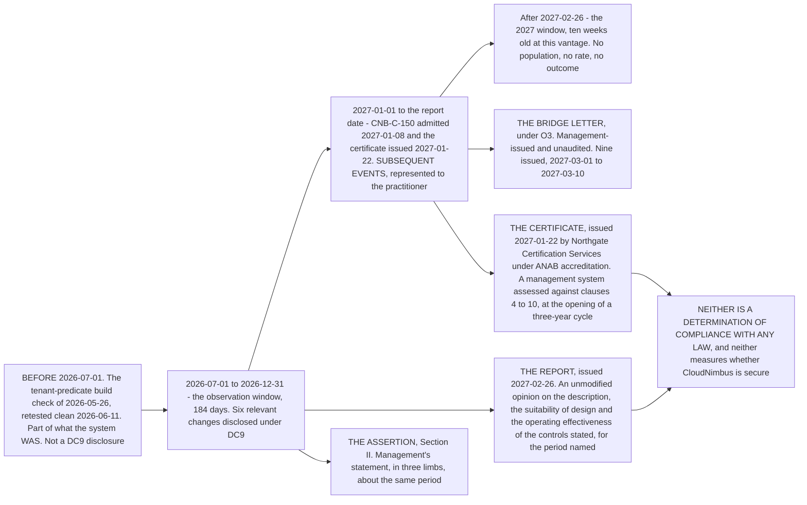

# Diagram — What Each Document Covers, and What It Does Not

| Field | Value |
|---|---|
| Document ID | CNB-TRUST-2027-D36 |
| Version | 1.0 |
| Date | 2027-03-11 |
| Owner | Rahul Bhargava |
| Approver | Karim Haddad |
| Classification | Confidential — Trust &amp; Assurance Programme // Illustrative Portfolio Sample |

## What each instrument covers

| Instrument | Object | Period or point | Who says it | Assurance behind it |
|---|---|---|---|---|
| **The report** | The controls stated in the description, against 61 trust services criteria | **Throughout 2026-07-01 to 2026-12-31** | Ashcombe &amp; Doyle LLP | **Reasonable assurance**, with the tests and the results printed in Section IV |
| **The assertion** | The same description and the same controls | The same period | CloudNimbus management | **None of its own.** It is the thing examined |
| **The bridge letter** | Changes to the system or the controls, and incidents, in the gap | **2027-01-01 to the customer's fiscal year end** | CloudNimbus management | **None.** Unaudited, no practitioner opinion, no tests |
| **The certificate** | The information security management system across the whole organisation | **A three-year cycle from the decision of 2027-01-20** | Northgate Certification Services, Ltd. | Accredited certification, verified by audit at Stage 1, Stage 2 and a supplementary audit |

## What none of them covers

**None of them says CloudNimbus is secure.** An examination measures specified controls against specified
criteria over a stated period; a certification audit assesses whether a management system conforms to
clauses 4 to 10. **`09.04` §3 owns the rest of that argument**, including what security is a property of and
how far either document sits from it.

**None of them is a determination of compliance with any law.** Not the GDPR, not the CCPA or CPRA, not any
state privacy statute. That sentence has appeared in every phase of this programme since the first.

**None of them is interchangeable with another.** One evidence programme produced two deliverables: an
examination report carrying an opinion, and a certificate. **Neither is stronger and neither substitutes** —
and `09.04` §3 says why the two do not combine into a third document.

**And none of them predicts anything.** The proof is inside the report: the RT-02 deletion job addressed an
emptied relation for sixty-eight consecutive nights, **eleven weeks before the period ended**, inside the
period an unmodified opinion was expressed on, and nothing in the control library detected it.

## The three intervals, and the disclosure attaching to each

| Interval | What happened there | Where it is disclosed |
|---|---|---|
| **Before 2026-07-01** | The tenant-predicate build check of 2026-05-26, `R-37`'s remediation, retested clean 2026-06-11 | **Nowhere in the report.** It is part of what the system was on the day the window opened |
| **During the period** | Six relevant changes — the re-scheduled annual controls, the EU log partition cut-over, the geolocation table migration, `CNB-C-096` amended, `CNB-C-149` admitted, the replacement sub-processor | **DC9**, in the description — `09.03` §3 |
| **After 2026-12-31** | `CNB-C-150` admitted 2027-01-08; the certificate issued 2027-01-22 | **Subsequent events**, represented in the representation letter; the certificate also in **Section V** |

**Putting a change in the wrong interval is not a rounding error: it tells a reader the system changed when
it did not.** And one item belongs to none of the three, because it is not a change at all — **SC-01's
wording correction of 2026-09-24 is a correction to the description of a commitment that had always carried
the announced-maintenance exclusion.** `DEC-904` files it as such. **The distinction DC9 draws in time is
drawn here in kind.**

## Cross-References

| Document | Relationship |
|---|---|
| [09.03 DC9 — Relevant Changes During the Period](../09.03-dc9-relevant-changes-during-the-period.md) | The chapter this diagram belongs to; the three-way test and the six changes |
| [09.01 Management's Assertion and the Representation Letter](../09.01-managements-assertion-and-the-representation-letter.md) | The two subsequent events represented |
| [09.04 The Report and the Opinion](../09.04-the-report-and-the-opinion.md) | What an unmodified opinion is not |
| [09.07 Section V and What the Opinion Does Not Cover](../09.07-section-v-and-what-the-opinion-does-not-cover.md) | The certificate, and why it is not covered by the opinion |
| [09.09 The Bridge Letter](../09.09-the-bridge-letter.md) | The gap instrument, and what it is worth |
| [09.13 What This Portfolio Claims and What It Does Not](../09.13-what-this-portfolio-claims-and-what-it-does-not.md) | The longer list of what none of this claims |
| [diagrams/09-the-five-sections-and-who-writes-them.md](09-the-five-sections-and-who-writes-them.md) | The same instruments, by author |
| [logs/decision-log.md](../logs/decision-log.md) | DEC-904 |
| [07.03 The RT-02 Retention Failure](../../07-confidentiality-privacy-and-third-party-assurance/07.03-the-rt-02-retention-failure.md) | The failure inside the period an unmodified opinion covers |
