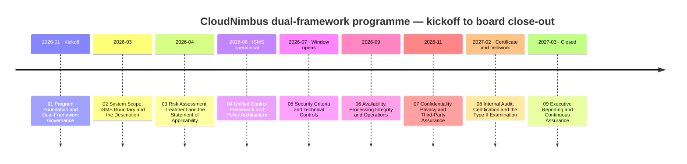
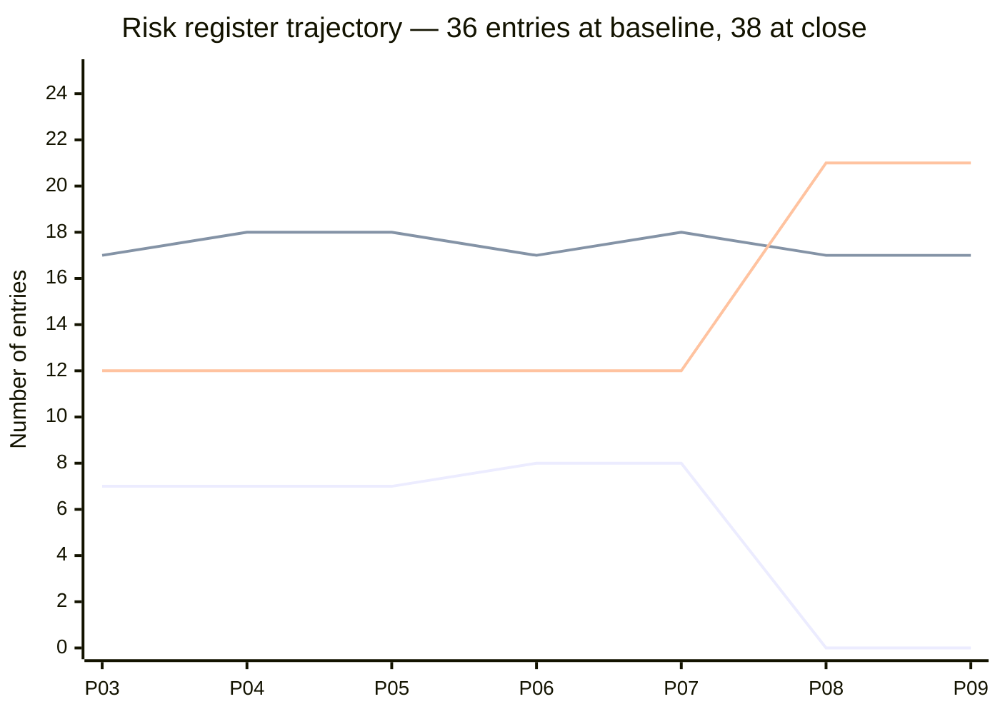

# SaaS Startup — SOC 2 Type II and ISO/IEC 27001:2022 Compliance Program

### 📊 [**View the Executive Dashboard →**](docs/DASHBOARD.md) &nbsp;·&nbsp; 🗂️ [Jump to full repository map](#️-repository-map--links-to-every-folder)

> An end-to-end, illustrative **dual-framework trust and assurance programme** for a fictitious B2B SaaS company — **CloudNimbus, Inc.** — taken from programme foundation through scoping, risk assessment, a single unified control library, control implementation, six months of operating record, an outsourced internal audit, a two-stage certification audit and a **SOC 2 Type II examination**, to a board close-out. **187 people, 640 customers, ~1.24M end users, $38.4M ARR, AWS only.**
>
> **Two deliverables, one evidence programme.** A **SOC 2 Type II examination report** issued 2027-02-26 with an **unmodified opinion and nine test exceptions disclosed in Section IV**, and an **ISO/IEC 27001:2022 certificate** issued 2027-01-22 by an ANAB-accredited certification body, valid to 2030-01-21. **There is no third thing the two combine into, and this repository never pretends there is.**
>
> **All names, data, figures and findings are fictional**, produced as a professional portfolio demonstration of dual-framework GRC capability. Nothing here represents a real service organisation, a real examination, a real certification audit or a real CPA firm.

---

## The one thing worth knowing about this portfolio

**The programme's worst finding was not something CloudNimbus missed. It was something it decided — and the objective the whole programme was designed around is the one it failed.**

ISO Stage 2 raised a **major nonconformity against clause 9.2** on 2026-12-02: the internal audit programme covered the 93 Annex A controls in the Statement of Applicability and did **not** cover clauses 4 to 10 themselves, or `eu-central-1`. The fact had been in CloudNimbus's own records for eleven months — `01.11` §7 recorded CAL-14's coverage as undefined and raised `PR-06` in January 2026, it was read again in September, agreed with, **minuted at the highest governance body in the ISMS and deferred twice.** It was accepted at the closing meeting without contest ([ADR-0037](08-internal-audit-certification-and-type-ii-examination/adr/ADR-0037-the-major-is-accepted-not-argued.md)).

> **An entity that failed to notice a gap has a detection problem. An entity that noticed it, took it to its highest governance body and decided to leave it has a different one — and the second is not the kind that monitoring evidence answers.** — [09.13 §2](09-executive-reporting-and-continuous-assurance/09.13-what-this-portfolio-claims-and-what-it-does-not.md)

And the close-out opens on a red row. **OBJ-03 — the integration objective, the one that measures the single control library, the single evidence store and the produce-once-use-twice argument every phase was built on — was missed at 16.9% against a 70% target: 356 evidence artefacts of 2,103.** [09.11](09-executive-reporting-and-continuous-assurance/09.11-the-programme-against-its-objectives.md) reports the miss in its first paragraph, **before** it explains it, and then makes the explanation a second finding rather than an excuse: the measure was wrong. The integration dividend was never in the artefacts, it was in the controls — **113 of 150 library controls serve both frameworks, 75.3%, which clears the 70% bar on the measure the objective should have used.**

**That better measure is published and is not substituted.** [ADR-0043](09-executive-reporting-and-continuous-assurance/adr/ADR-0043-obj-03-is-reported-missed-before-it-is-explained.md) refers the re-measurement to the body that sets objectives rather than the chapter that grades them, because **a programme that changes a measure in the document that scores it has scored itself.**

Then the charter's own success test, which nobody had ever marked:

> **01.07 §7 set four measurable success criteria and a fifth it called unmeasurable. Until 09.11 §6 they had never been scored anywhere in this portfolio** — and when they were, three of four were met and the third was not. **A close-out that reports seven of eight objectives met while leaving the charter's own success test unscored has chosen the flattering instrument.** It went unscored because nothing required it to be scored, and **no control in the library asks whether a charter's success criteria have been marked at close.**

**Neither of those was volunteered. Both were found by an adversarial reader** — the first on Phase 08, where it sits inside that phase's count of 46, and the second on Phase 09. **338 defects were found and fixed across the eight phases issued before the last one**, and that count is [published in 09.13 §4](09-executive-reporting-and-continuous-assurance/09.13-what-this-portfolio-claims-and-what-it-does-not.md) with the uncomfortable reading attached: the largest single count belongs to the phase describing the failure the service auditor nearly modified the opinion over, and the document declines to choose between *the hardest material attracts the most correction* and *the hardest material was written least well the first time*.

---

## Programme at a glance

| Attribute | Value |
|---|---|
| Entity | **CloudNimbus, Inc.** — Delaware C-corp, Denver CO, founded 2019 · privately held, **not SEC-registered, no SOX** |
| Product | **The CloudNimbus Workforce Platform** — time capture, scheduling, absence and leave accrual, expense capture, and a **calculation engine** that derives overtime, differentials, accruals and reimbursements and outputs to customers' payroll providers |
| Size | **187 staff, remote-first across 31 US states and 4 countries** · one 4,100 sq ft Denver suite with **no production equipment** · **$38.4M ARR** · $62M raised to Series B |
| Customers | **640** employers · **~1.24M** end users · **41** customers on EU data residency, served from `eu-central-1` |
| Estate | **AWS only** — 7 accounts · 4 EKS clusters · 63 microservices · 6 Aurora PostgreSQL clusters · 214 S3 buckets · 231 managed endpoints · 96 internal SaaS applications |
| SOC 2 | **Type II across all five trust services categories** — Security, Availability, Processing Integrity, Confidentiality, Privacy · **61 applicable criteria** · window **2026-07-01 → 2026-12-31** |
| SOC 2 outcome | Report issued **2027-02-26**. **Unmodified opinion, with nine test exceptions disclosed in Section IV** — and the service auditor **considered modifying the opinion over one of them** |
| ISO | **ISO/IEC 27001:2022 including Amd 1:2024** · ISMS scope is **the whole organisation**, not carved to engineering |
| ISO outcome | **Certificate issued 2027-01-22** by **Northgate Certification Services, Ltd.** under **ANAB** accreditation, valid to **2030-01-21** · Stage 2 produced **1 major · 4 minor · 7 opportunities for improvement** |
| Statement of Applicability | **93 Annex A controls · 91 determined necessary · 2 determined not necessary** · **four exclusions argued for and refused** |
| Control library | **150 controls** — **113 dual-serving · 21 SOC 2-only · 16 ISO-only** · 19 policies · 24 evidence classes · **no control owned by a team** |
| Prior baseline | **2025 Type I, Security only, unmodified**, from a predecessor CPA firm — with **three management letter points**, two of which became Type II test exceptions eighteen months later |
| Risk | **38 entries** · baseline 36 (7 High) → close **0 High · 17 Moderate · 21 Low** · **2 added on evidence, none closed, none removed** |
| Against the published forecast | Forecast **0 · 16 · 22** · actual **0 · 17 · 21** — **one entry at the band level, five entries crossing a band underneath it, eleven ratings diverging in all** |
| Objectives | **7 of 8 met.** OBJ-03 **missed at 16.9% against 70%** · the charter's four success criteria scored for the first time at close: **3 met, 1 not met** |
| Cost | **$1,366,000** committed against a **$1,400,000** envelope over ~14 months · **4.6 FTE-equivalents** · internal labour at $612,000 exceeds every external fee combined |
| Scale | **9 phases · 126 numbered documents · 343 markdown files · 42 Excel trackers · 36 diagrams · 45 ADRs · 37 templates · 36 governance records · 116 decisions · 2,103 evidence artefacts** |

*Three lines: **High** (7 → 0), **Moderate** (17 → 17) and **Low** (12 → 21). The register is **flat for five phases and then moves nineteen entries at one review** — the December 2026 CAL-06, the first review with a closed six-month window behind it. Every earlier review said it was waiting for exactly that, and the September review **took six reduction proposals and accepted none of them**, then re-rated one entry **upward** that nobody had proposed. **High rises before it falls**, because R-37 was admitted on penetration test evidence at 4 × 5 = 20 and R-08 was raised to High on nine occurrences of its described event in ninety-two days.*

---

## 🗂️ Repository map — links to every folder

Each phase is a top-level folder containing a numbered document set (`NN.00`–`NN.13`) in execution order, plus six artifact sub-folders.

| Phase | Overview | 🖼️ Diagrams | 📈 Trackers (Excel) | 📝 Logs | 🏛️ Governance | 🧭 ADRs | 📋 Templates |
|---|---|---|---|---|---|---|---|
| **01 — Program Foundation and Dual-Framework Governance** | [README](01-program-foundation-dual-framework-governance/01.00-README.md) | [diagrams](01-program-foundation-dual-framework-governance/diagrams) | [trackers](01-program-foundation-dual-framework-governance/trackers) | [logs](01-program-foundation-dual-framework-governance/logs) | [governance](01-program-foundation-dual-framework-governance/governance) | [adr](01-program-foundation-dual-framework-governance/adr) | [templates](01-program-foundation-dual-framework-governance/templates) |
| **02 — System Scope, ISMS Boundary and the Description** | [README](02-system-scope-isms-boundary-and-description/02.00-README.md) | [diagrams](02-system-scope-isms-boundary-and-description/diagrams) | [trackers](02-system-scope-isms-boundary-and-description/trackers) | [logs](02-system-scope-isms-boundary-and-description/logs) | [governance](02-system-scope-isms-boundary-and-description/governance) | [adr](02-system-scope-isms-boundary-and-description/adr) | [templates](02-system-scope-isms-boundary-and-description/templates) |
| **03 — Risk Assessment, Treatment and the Statement of Applicability** | [README](03-risk-assessment-treatment-and-statement-of-applicability/03.00-README.md) | [diagrams](03-risk-assessment-treatment-and-statement-of-applicability/diagrams) | [trackers](03-risk-assessment-treatment-and-statement-of-applicability/trackers) | [logs](03-risk-assessment-treatment-and-statement-of-applicability/logs) | [governance](03-risk-assessment-treatment-and-statement-of-applicability/governance) | [adr](03-risk-assessment-treatment-and-statement-of-applicability/adr) | [templates](03-risk-assessment-treatment-and-statement-of-applicability/templates) |
| **04 — Unified Control Framework and Policy Architecture** | [README](04-unified-control-framework-and-policy-architecture/04.00-README.md) | [diagrams](04-unified-control-framework-and-policy-architecture/diagrams) | [trackers](04-unified-control-framework-and-policy-architecture/trackers) | [logs](04-unified-control-framework-and-policy-architecture/logs) | [governance](04-unified-control-framework-and-policy-architecture/governance) | [adr](04-unified-control-framework-and-policy-architecture/adr) | [templates](04-unified-control-framework-and-policy-architecture/templates) |
| **05 — Security Criteria and Technical Controls** | [README](05-security-criteria-and-technical-controls/05.00-README.md) | [diagrams](05-security-criteria-and-technical-controls/diagrams) | [trackers](05-security-criteria-and-technical-controls/trackers) | [logs](05-security-criteria-and-technical-controls/logs) | [governance](05-security-criteria-and-technical-controls/governance) | [adr](05-security-criteria-and-technical-controls/adr) | [templates](05-security-criteria-and-technical-controls/templates) |
| **06 — Availability, Processing Integrity and Operations** | [README](06-availability-processing-integrity-and-operations/06.00-README.md) | [diagrams](06-availability-processing-integrity-and-operations/diagrams) | [trackers](06-availability-processing-integrity-and-operations/trackers) | [logs](06-availability-processing-integrity-and-operations/logs) | [governance](06-availability-processing-integrity-and-operations/governance) | [adr](06-availability-processing-integrity-and-operations/adr) | [templates](06-availability-processing-integrity-and-operations/templates) |
| **07 — Confidentiality, Privacy and Third-Party Assurance** | [README](07-confidentiality-privacy-and-third-party-assurance/07.00-README.md) | [diagrams](07-confidentiality-privacy-and-third-party-assurance/diagrams) | [trackers](07-confidentiality-privacy-and-third-party-assurance/trackers) | [logs](07-confidentiality-privacy-and-third-party-assurance/logs) | [governance](07-confidentiality-privacy-and-third-party-assurance/governance) | [adr](07-confidentiality-privacy-and-third-party-assurance/adr) | [templates](07-confidentiality-privacy-and-third-party-assurance/templates) |
| **08 — Internal Audit, Certification and the Type II Examination** | [README](08-internal-audit-certification-and-type-ii-examination/08.00-README.md) | [diagrams](08-internal-audit-certification-and-type-ii-examination/diagrams) | [trackers](08-internal-audit-certification-and-type-ii-examination/trackers) | [logs](08-internal-audit-certification-and-type-ii-examination/logs) | [governance](08-internal-audit-certification-and-type-ii-examination/governance) | [adr](08-internal-audit-certification-and-type-ii-examination/adr) | [templates](08-internal-audit-certification-and-type-ii-examination/templates) |
| **09 — Executive Reporting and Continuous Assurance** | [README](09-executive-reporting-and-continuous-assurance/09.00-README.md) | [diagrams](09-executive-reporting-and-continuous-assurance/diagrams) | [trackers](09-executive-reporting-and-continuous-assurance/trackers) | [logs](09-executive-reporting-and-continuous-assurance/logs) | [governance](09-executive-reporting-and-continuous-assurance/governance) | [adr](09-executive-reporting-and-continuous-assurance/adr) | [templates](09-executive-reporting-and-continuous-assurance/templates) |

---

## The nine phases, and what each one is actually for

| Phase | What it does | The thing worth reading it for |
|---|---|---|
| **[01](01-program-foundation-dual-framework-governance/01.00-README.md)** | Category selection, the certification route, the charter and its eight objectives, obligations **O1–O12**, RACI, the assurance calendar | **The prior clean Type I is treated as the programme's best source of bad news.** Its three management letter points are carried as programme inputs — and [ADR-0005](01-program-foundation-dual-framework-governance/adr/ADR-0005-stage-2-inside-the-type-ii-observation-window.md) accepts the Stage 2 scheduling collision **knowingly in January**, rather than discovering it in December |
| **[02](02-system-scope-isms-boundary-and-description/02.00-README.md)** | Two boundaries · 1,046 ISMS assets and 800 system assets · 12 data flows · 12 personal-data categories · CUECs and CSOCs | **Neither boundary contains the other**, and [ADR-0006](02-system-scope-isms-boundary-and-description/adr/ADR-0006-two-boundaries-neither-contains-the-other.md) refuses to force them together. **15 CUECs proposed, 4 refused, 11 disclosed.** And `RT-07` and `RT-08` are left in open conflict — **30 + 35 = 65 days of residue, disclosed rather than engineered away** |
| **[03](03-risk-assessment-treatment-and-statement-of-applicability/03.00-README.md)** | The **36-entry baseline register** and its scoring model · treatment plan TP-01 to TP-34 · the **Statement of Applicability** | **Four Annex A exclusions were argued for and refused**, and the refusals are the chapter. **No risk was avoided, and Phase 03 says so** rather than manufacturing one. [ADR-0015](03-risk-assessment-treatment-and-statement-of-applicability/adr/ADR-0015-no-forecast-until-proved-reachable.md) publishes a close forecast **only after a build harness proved it reachable** |
| **[04](04-unified-control-framework-and-policy-architecture/04.00-README.md)** | One library of **148 controls** · 19 policies · **24 evidence classes declared before the controls existed** | **Controls were designed from risks and commitments; the mapping to criteria and Annex A was recorded afterwards** — and 04.03 states what happens to a programme that gets that order the wrong way round. **A framework mapping is an assertion by the mapper, not an authority** |
| **[05](05-security-criteria-and-technical-controls/05.00-README.md)** | CC6–CC9 as running machinery: identity, privileged access, tenant isolation, cryptography, boundaries, endpoints, vulnerabilities, change, detection | **The programme's most load-bearing assumption was disproved by evidence.** A May penetration test found a **Critical tenant isolation flaw** in a reporting API; **R-37** was admitted on it. [05.12](05-security-criteria-and-technical-controls/05.12-r37-tenant-isolation-finding-and-remediation.md) records what the log search **could not** establish — nine months of a twenty-two-month exposure were unexaminable |
| **[06](06-availability-processing-integrity-and-operations/06.00-README.md)** | Availability, DR, the Q3 operating record, and Processing Integrity where a wrong number is a wrong paycheque | **A 71-minute Severity-1: detection worked and measurement did not.** `CNB-C-068` paged in two minutes; `CNB-C-096`'s probe performed a **read**, so no burn registered against the error budget through 71 minutes in which writes failed. **The August restore test was not performed, and was not re-performed and back-dated** — [ADR-0026](06-availability-processing-integrity-and-operations/adr/ADR-0026-the-missed-restore-test-is-not-back-dated.md) |
| **[07](07-confidentiality-privacy-and-third-party-assurance/07.00-README.md)** | Two confidentiality criteria, eighteen privacy criteria, 84 vendors, 11 sub-processors and two carved-out subservice organisations | **A retention rule was not enforced for sixty-eight nights and nothing alerted, because nothing failed.** The examination found it, not the control. **41 customers were notified where no commitment required it, over a minuted dissent** — [ADR-0032](07-confidentiality-privacy-and-third-party-assurance/adr/ADR-0032-notification-with-no-obligation-to-notify.md). And **`CA-07-01` is a corrective action with no deviation behind it** |
| **[08](08-internal-audit-certification-and-type-ii-examination/08.00-README.md)** | Four independent parties reporting in three vocabularies inside twenty weeks · Stage 1, Stage 2, the certificate, and Type II fieldwork | **The major nonconformity was in the records as a decision, not a miss.** Nine test exceptions, **every one found by CloudNimbus before the service auditor found it** — and **the opinion is not stated**, because fieldwork closed on this phase's vantage and forecasting it would be the thing [ADR-0015](03-risk-assessment-treatment-and-statement-of-applicability/adr/ADR-0015-no-forecast-until-proved-reachable.md) forbids |
| **[09](09-executive-reporting-and-continuous-assurance/09.00-README.md)** | The assertion, the description, DC9, the report and the opinion, Section IV, Section V, restricted use, the bridge letter, and the close-out | **The phase in which a portfolio congratulates itself, and this one does not.** The near-modification reasoning is reproduced rather than the conclusion; the forecast is taken apart entry by entry; **OBJ-03's miss is reported before it is explained**; and [ADR-0045](09-executive-reporting-and-continuous-assurance/adr/ADR-0045-nothing-is-closed-to-make-the-close-out-tidy.md) leaves sixteen corrective actions open and reported open |

---

## Numbers a reviewer can check

| Claim | Where it is evidenced |
|---|---|
| **61 criteria = 33 + 3 + 5 + 2 + 18**, category by category | [01.05](01-program-foundation-dual-framework-governance/01.05-trust-services-category-selection.md) · [09.11 §5](09-executive-reporting-and-continuous-assurance/09.11-the-programme-against-its-objectives.md) |
| **93 Annex A controls = 91 necessary + 2 not necessary**, and per theme 37 + 8 + 14 + 34 | [03.09](03-risk-assessment-treatment-and-statement-of-applicability/03.09-statement-of-applicability-organizational-controls.md) · [03.10](03-risk-assessment-treatment-and-statement-of-applicability/03.10-statement-of-applicability-people-physical-technological.md) |
| **150 controls = 113 dual + 21 SOC 2-only + 16 ISO-only**, and **113 ÷ 150 = 75.3%** | [09.11 §4](09-executive-reporting-and-continuous-assurance/09.11-the-programme-against-its-objectives.md) |
| **Each of the eight exception rates recomputes from the two columns to its left** — the ninth carries an event and no rate, deliberately | [09.06 §2](09-executive-reporting-and-continuous-assurance/09.06-section-iv-and-the-nine-exceptions-as-published.md) · `trackers/` |
| **68 ÷ 184 = 37.0%**, and the same 68 nights against 8 rules × 3 regions × 184 nights = **1.5%** — both printed | [09.06 §2](09-executive-reporting-and-continuous-assurance/09.06-section-iv-and-the-nine-exceptions-as-published.md) · [09.05 §2](09-executive-reporting-and-continuous-assurance/09.05-the-near-modification-resolved.md) |
| **16 + 3 − 2 = 17** and **22 − 3 + 2 = 21** — the forecast reconciled entry by entry, in both directions | [09.10 §3](09-executive-reporting-and-continuous-assurance/09.10-the-register-at-close-forecast-against-actual.md) |
| **318 + 281 = 599**, and **599 + 41 = 640** — the incident population, region by region | [06.05](06-availability-processing-integrity-and-operations/06.05-the-severity-1-incident-of-2026-09-08.md) |
| **40,930 + 278 = 41,208** refused writes, resubmitted and not | [06.08](06-availability-processing-integrity-and-operations/06.08-input-validation-and-completeness.md) |
| **168 + 302 + 121 + 49 = 640** customers behind 5,171 payroll export files | [06.09](06-availability-processing-integrity-and-operations/06.09-output-accuracy-reconciliation-and-the-export.md) |
| **34 + 7 = 41** EU-residency customers, 34 with data in the unenforced retention rule and 7 without | [07.03](07-confidentiality-privacy-and-third-party-assurance/07.03-the-rt-02-retention-failure.md) |
| **11 + 73 = 84** vendors — **overlapping sets, never a three-way partition** | [07.09](07-confidentiality-privacy-and-third-party-assurance/07.09-the-vendor-register-tiering-and-assurance.md) |
| **356 of 2,103 = 16.9%**, against a 70% target | [09.11 §1](09-executive-reporting-and-continuous-assurance/09.11-the-programme-against-its-objectives.md) |
| **$1,366,000 of $1,400,000**, line by line, with internal labour larger than every external fee combined | [01.07 §6](01-program-foundation-dual-framework-governance/01.07-program-charter-and-objectives.md) · [09.11 §3](09-executive-reporting-and-continuous-assurance/09.11-the-programme-against-its-objectives.md) |

**Every Excel tracker in this repository is generated by parsing the narrative markdown, with assertions on the counts and the arithmetic.** The Phase 09 builder independently re-derives the forecast reconciliation entry by entry and fails the build if any entry's consequence has changed or any listed entry does not cross a band. **A workbook cannot drift from the prose, because it is derived from it.**

---

## The technical distinctions this portfolio gets right

| Distinction | Why it matters |
|---|---|
| **There is no SOC 2 certification** | SOC 2 is an **attestation examination** under AT-C sections 105 and 205 producing a **CPA's opinion**. Nobody is "SOC 2 certified" or "SOC 2 compliant." **And ISO does not certify anyone** — an accredited certification body does, here Northgate Certification Services under ANAB accreditation |
| **There is no combined SOC 2 / ISO 27001 report** | One evidence programme, **two separate deliverables**: an examination report and a certificate. [09.04 §3](09-executive-reporting-and-continuous-assurance/09.04-the-report-and-the-opinion.md) says why there is no third thing they combine into |
| **An unmodified opinion does not mean zero exceptions** | **"Clean opinion" is not a term the standards use.** Test exceptions are disclosed in Section IV; the practitioner modifies only where the deviations mean the applicable criteria were not achieved. Nine were disclosed here, and **one came close to a modification** — [09.05](09-executive-reporting-and-continuous-assurance/09.05-the-near-modification-resolved.md) reproduces the reasoning rather than the conclusion |
| **Management writes Section III; the service auditor writes Section IV** | The description states what a control **is**. Section IV states what was **tested**, on what population, and what was **found**. **A portfolio that blurs the two has misunderstood the document.** [09.06 §1](09-executive-reporting-and-continuous-assurance/09.06-section-iv-and-the-nine-exceptions-as-published.md) |
| **Section V is not covered by the opinion** | Which is exactly why it carries the certificate and the Stage 2 major nonconformity **together** — [ADR-0042](09-executive-reporting-and-continuous-assurance/adr/ADR-0042-section-v-carries-both-or-neither.md). Including one without the other is selective disclosure in the one section where selectivity is all a reader can measure |
| **A SOC 2 report is restricted-use, and a bridge letter is unaudited** | The report is intended for management, for **user entities during the period**, and for other specified parties with sufficient knowledge and understanding. **Restricted use is not a confidentiality agreement** ([09.08 §3](09-executive-reporting-and-continuous-assurance/09.08-restricted-use-and-the-distribution.md)), and a management-issued bridge letter **covers a gap without closing one** ([09.09 §2](09-executive-reporting-and-continuous-assurance/09.09-the-bridge-letter.md)) |
| **Points of focus are not requirements. Annex A is not the requirements** | Points of focus *may* assist in evaluating a criterion and are not a checklist. ISO conformity is assessed against **clauses 4 to 10**, with Annex A reached through **clause 6.1.3 c)** as a comparison verifying no necessary control has been omitted |
| **"Nonconformity" is ISO. "Exception" and "deviation" are SOC 2** | Four registers of findings in three vocabularies arrived inside twenty weeks and **none of them converts into another**. [08.12](08-internal-audit-certification-and-type-ii-examination/08.12-the-scheduling-collision.md) keeps them apart, including where the same fact is classified differently by each |
| **A correction is not a corrective action** | Clause 10.2 distinguishes them in words. Fixing the instances is a correction; **10.2 b) and c) ask what caused it and whether it exists elsewhere**. The temptation to repair a denominator arrived three times in three phases and was refused three times |
| **A Type I has no test exceptions, because it has no tests of operating effectiveness** | Type I is suitability of **design as of a date**; Type II is design **and operating effectiveness throughout a period**. A clean Type I is not a weaker Type II — **it is a different question**, and [01.04](01-program-foundation-dual-framework-governance/01.04-prior-type-i-baseline-and-carried-matters.md) treats it as the programme's best source of bad news |
| **CUECs are tested by the user entity's auditor, not by the service auditor** | Which is why **CUEC-05's 411 confirmations are unverified self-assertions carrying no assurance weight**, and why 229 non-responses are neither failures nor successes |
| **The two scope boundaries are different objects** | SOC 2 scope is a **system**; ISO scope is an **ISMS boundary**, which is organisational. **Neither contains the other here**, and forcing them to coincide is the error [ADR-0006](02-system-scope-isms-boundary-and-description/adr/ADR-0006-two-boundaries-neither-contains-the-other.md) refuses |
| **A framework mapping is an assertion by the mapper** | No regulator or standards body blesses a criteria-to-Annex-A crosswalk. CloudNimbus's mapping is CloudNimbus's, and **its defensibility is its own problem** — [04.03](04-unified-control-framework-and-policy-architecture/04.03-mapping-methodology-and-its-limits.md) |

**Neither deliverable is a determination of compliance with any law** — not the GDPR, not the CCPA or CPRA, not any state privacy statute. **No fine or penalty amount appears anywhere in this repository.** Programme cost and professional fees are published and are not penalties.

---

## The uncomfortable things, collected

A portfolio that only shows what went well is a portfolio about writing, not about compliance. These are on the record, in the phase that found them:

| What | Where |
|---|---|
| **A Critical tenant isolation flaw** was found by penetration test, and the log search **could not examine nine months of a twenty-two-month exposure** — stated rather than replaced with "no evidence of access" | [05.12](05-security-criteria-and-technical-controls/05.12-r37-tenant-isolation-finding-and-remediation.md) |
| **A 71-minute Severity-1 in which detection worked and measurement did not** — the availability probe performed a read, so every word of the control was satisfied and no burn registered | [06.05](06-availability-processing-integrity-and-operations/06.05-the-severity-1-incident-of-2026-09-08.md) |
| **The August restore test simply did not happen**, and was not re-performed and back-dated. **An occurrence is an event on a date** | [06.03](06-availability-processing-integrity-and-operations/06.03-backup-restore-and-data-durability.md) · [ADR-0026](06-availability-processing-integrity-and-operations/adr/ADR-0026-the-missed-restore-test-is-not-back-dated.md) |
| **A quarterly review that took six reduction proposals and accepted none of them**, then moved one entry **upward** that nobody had proposed — firing the CEO escalation rule for the first time | [06.11](06-availability-processing-integrity-and-operations/06.11-operations-monitoring-and-the-quarterly-review.md) |
| **A retention rule unenforced for sixty-eight nights, found by an auditor's evidence request rather than by any control.** **A completion record nobody reads is a log, not a control** | [07.03](07-confidentiality-privacy-and-third-party-assurance/07.03-the-rt-02-retention-failure.md) |
| **A corrective action with no deviation behind it** — reading the other side's report produced two complementary user entity controls with no owner, and **the absence is the finding** | [07.10](07-confidentiality-privacy-and-third-party-assurance/07.10-reading-the-other-sides-complementary-controls.md) |
| **A major nonconformity that had been read, agreed with, minuted at the highest governance body in the ISMS and deferred twice** — and was accepted at the closing meeting without contest | [08.05](08-internal-audit-certification-and-type-ii-examination/08.05-stage-2-and-the-major-nonconformity.md) · [ADR-0037](08-internal-audit-certification-and-type-ii-examination/adr/ADR-0037-the-major-is-accepted-not-argued.md) |
| **The service auditor considered modifying the opinion, and the reasoning is reproduced including the parts that point the other way** — a different engagement team on the same facts could have reached the other answer | [09.05](09-executive-reporting-and-continuous-assurance/09.05-the-near-modification-resolved.md) · [ADR-0041](09-executive-reporting-and-continuous-assurance/adr/ADR-0041-the-near-modification-reasoning-is-published.md) |
| **A forecast right at the band level and wrong five times underneath it** — with the aggregate shown to have absorbed four of the five errors and revealed the fifth | [09.10](09-executive-reporting-and-continuous-assurance/09.10-the-register-at-close-forecast-against-actual.md) |
| **The integration objective missed by a factor of four**, reported before it is explained, with the better measure published and deliberately **not** substituted | [09.11 §1](09-executive-reporting-and-continuous-assurance/09.11-the-programme-against-its-objectives.md) · [ADR-0043](09-executive-reporting-and-continuous-assurance/adr/ADR-0043-obj-03-is-reported-missed-before-it-is-explained.md) |
| **The charter's own four success criteria had never been scored anywhere**, and when they were, the third was not met | [09.11 §6](09-executive-reporting-and-continuous-assurance/09.11-the-programme-against-its-objectives.md) |
| **Sixteen corrective actions open at close, reported open** — and beside them **five open minor nonconformities**, Stage 2's four plus the correction audit's clause 7.4 minor, which is recorded rather than folded into the four | [09.12 §2.1](09-executive-reporting-and-continuous-assurance/09.12-continuous-assurance-and-the-board-report.md) · [ADR-0045](09-executive-reporting-and-continuous-assurance/adr/ADR-0045-nothing-is-closed-to-make-the-close-out-tidy.md) |
| **Seventeen issues open, and two of them owe a number nobody has produced** | [09.13 §5](09-executive-reporting-and-continuous-assurance/09.13-what-this-portfolio-claims-and-what-it-does-not.md) |
| **Two of the 2025 management letter points came back as Type II test exceptions eighteen months later.** *Remediating a control is not the same as remediating the evidence trail it leaves behind* | [09.11 §3](09-executive-reporting-and-continuous-assurance/09.11-the-programme-against-its-objectives.md) |
| **338 defects found by adversarial review across the eight phases issued before the last** — 19, 29, 26, 33, 34, 74, 77 and 46 — published with the reading that is not flattering attached | [09.13 §4](09-executive-reporting-and-continuous-assurance/09.13-what-this-portfolio-claims-and-what-it-does-not.md) |
| **Five re-issues across three phases** — Phase 01 once, Phase 02 once, **Phase 04 three times** — because amendments were made at source. **A library that corrects itself silently cannot demonstrate that it was ever wrong** | [09.11 §5](09-executive-reporting-and-continuous-assurance/09.11-the-programme-against-its-objectives.md) |

---

## 🧭 The 45 architecture decisions

The ADR series runs unbroken from **ADR-0001** to **ADR-0045** across all nine phases. Five shaped the outcome more than the rest:

| ADR | Decision | Phase |
|---|---|---|
| **[0005](01-program-foundation-dual-framework-governance/adr/ADR-0005-stage-2-inside-the-type-ii-observation-window.md)** | **Schedule Stage 2 inside the Type II observation window**, accepting the contradictory-evidence risk in January rather than discovering it in December | 01 |
| **[0015](03-risk-assessment-treatment-and-statement-of-applicability/adr/ADR-0015-no-forecast-until-proved-reachable.md)** | **No close forecast is published until the build harness has proved it reachable** — the previous portfolio's lesson institutionalised as a rule | 03 |
| **[0026](06-availability-processing-integrity-and-operations/adr/ADR-0026-the-missed-restore-test-is-not-back-dated.md)** | **The missed restore test is not back-dated** — an occurrence is an event on a date, and a repaired denominator is a repaired record | 06 |
| **[0037](08-internal-audit-certification-and-type-ii-examination/adr/ADR-0037-the-major-is-accepted-not-argued.md)** | **The major nonconformity is accepted, not argued** — with the reasoning for not arguing it down recorded rather than the outcome alone | 08 |
| **[0043](09-executive-reporting-and-continuous-assurance/adr/ADR-0043-obj-03-is-reported-missed-before-it-is-explained.md)** | **OBJ-03 is reported missed before it is explained**, and the better measure is referred to the body that sets objectives rather than the chapter that grades them | 09 |

Full index: [Phase 09 ADR folder](09-executive-reporting-and-continuous-assurance/adr).

---

## How to read this repository

**If you have five minutes** — read this page and the [Executive Dashboard](docs/DASHBOARD.md).

**If you have thirty** — read [09.04](09-executive-reporting-and-continuous-assurance/09.04-the-report-and-the-opinion.md) (what the opinion says and what it is not), [09.05](09-executive-reporting-and-continuous-assurance/09.05-the-near-modification-resolved.md) (the centrepiece), [09.10](09-executive-reporting-and-continuous-assurance/09.10-the-register-at-close-forecast-against-actual.md) (the forecast taken apart) and [09.13](09-executive-reporting-and-continuous-assurance/09.13-what-this-portfolio-claims-and-what-it-does-not.md) (what none of it claims).

**If you want the two failures the programme is really about** — [07.03](07-confidentiality-privacy-and-third-party-assurance/07.03-the-rt-02-retention-failure.md) and [08.05](08-internal-audit-certification-and-type-ii-examination/08.05-stage-2-and-the-major-nonconformity.md).

**If you are assessing the work itself** — pick any Excel tracker and any number in it, then find that number in the narrative document it was parsed from. They cannot disagree. Then check the four things [09.13 §5](09-executive-reporting-and-continuous-assurance/09.13-what-this-portfolio-claims-and-what-it-does-not.md) nominates: whether the one missed objective is reported as missed on the measure it was written against, whether the exceptions are printed with their populations, whether the forecast is marked against the actual in both directions, and whether anything closed in the last fortnight that should not have.

---

## Framing notes

**A SOC 2 examination produces an opinion and never a certificate.** No certificate exists against it and nobody holds one. The deliverable is a **restricted-use examination report** intended for management of the service organisation, for user entities during the period, and for other specified parties with sufficient knowledge and understanding — provided under non-disclosure on request, and **not a general-use document**.

**ISO does not certify anyone.** The certificate of 2027-01-22 was issued by **Northgate Certification Services, Ltd.**, accredited by **ANAB** under **ISO/IEC 17021-1** and **ISO/IEC 27006-1:2024**. Conformity is assessed against **clauses 4 to 10**; **Annex A is a reference set of 93 controls**, reached through clause 6.1.3 c), and **is not the requirements**.

**Neither deliverable is a determination of compliance with any law**, and no document in this repository reaches a legal conclusion of any kind. CloudNimbus is privately held, is not an SEC registrant and has no SOX control population. **No fine or penalty amount is stated anywhere in this repository**; programme cost and professional fees are published and are not penalties.

Everything here is fictional and illustrative. The "Confidential — Trust and Assurance Programme // Illustrative Portfolio Sample" classification lines exist for realism and mark nothing real.
