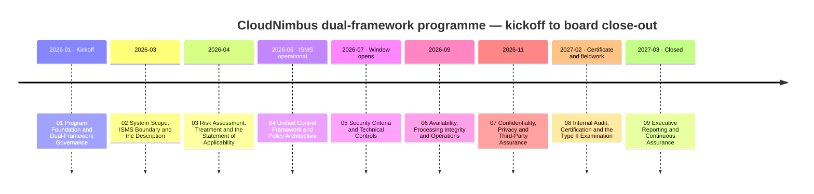
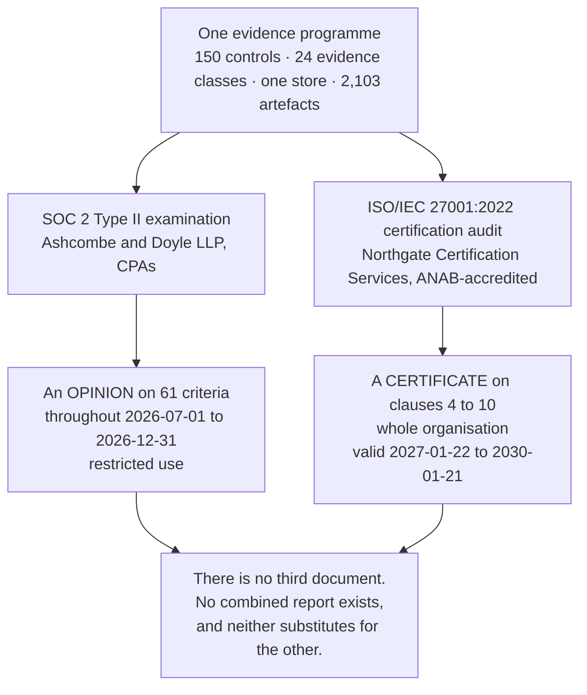
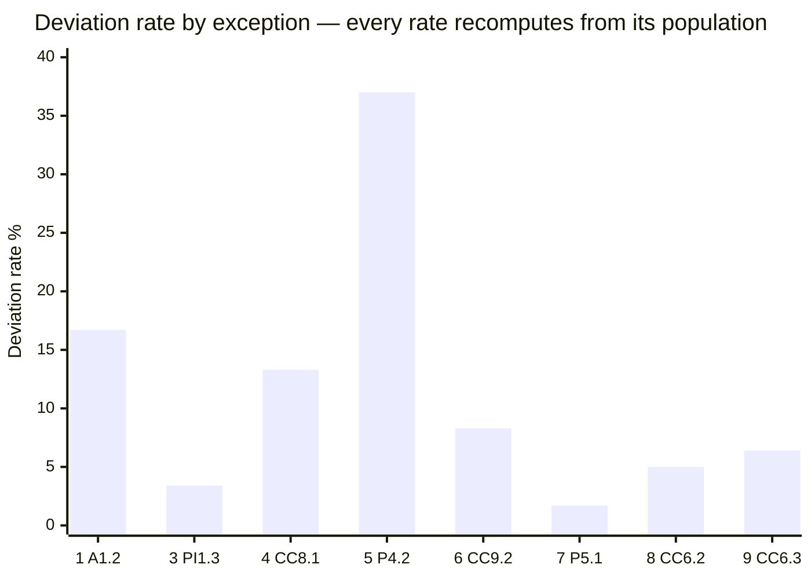
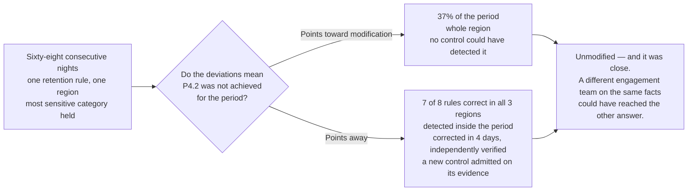
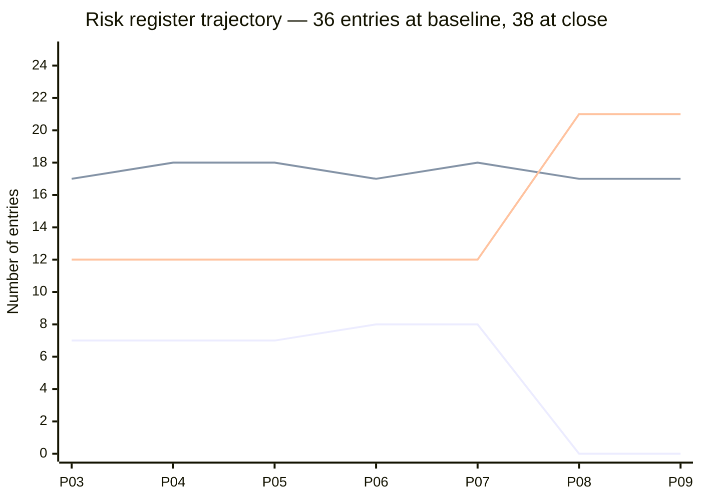
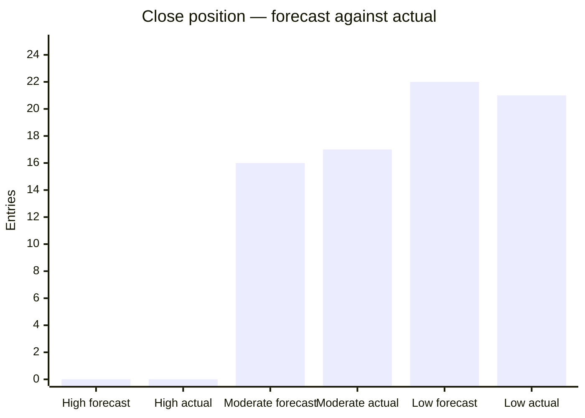
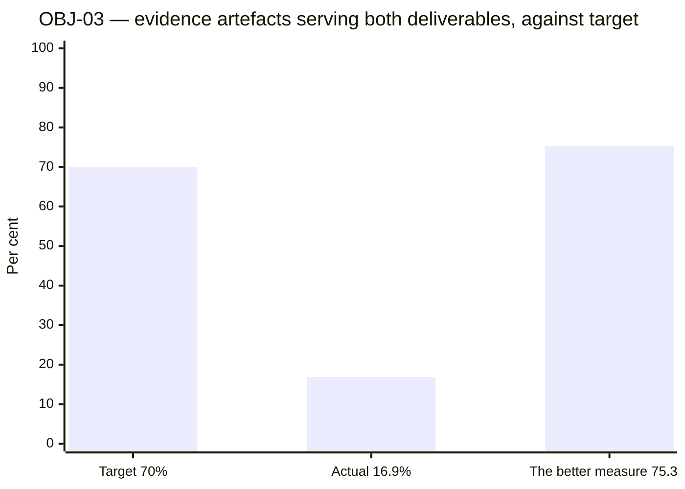
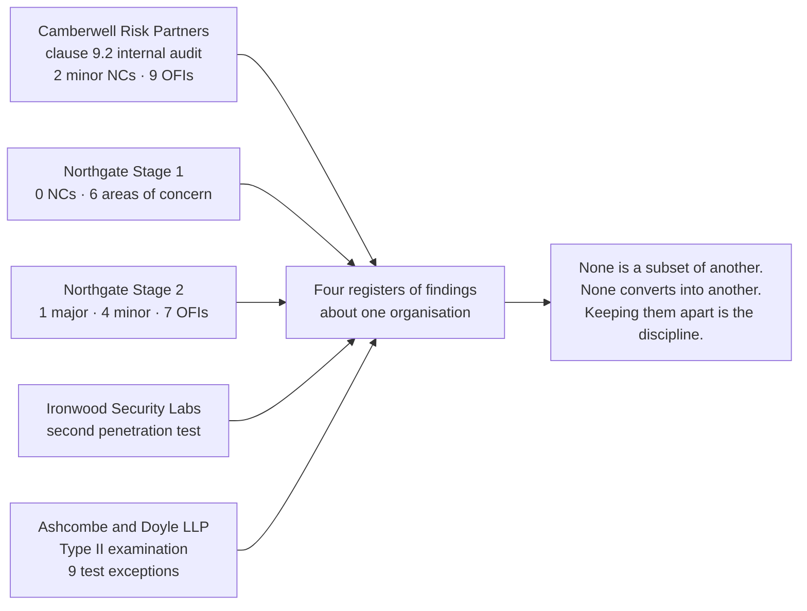
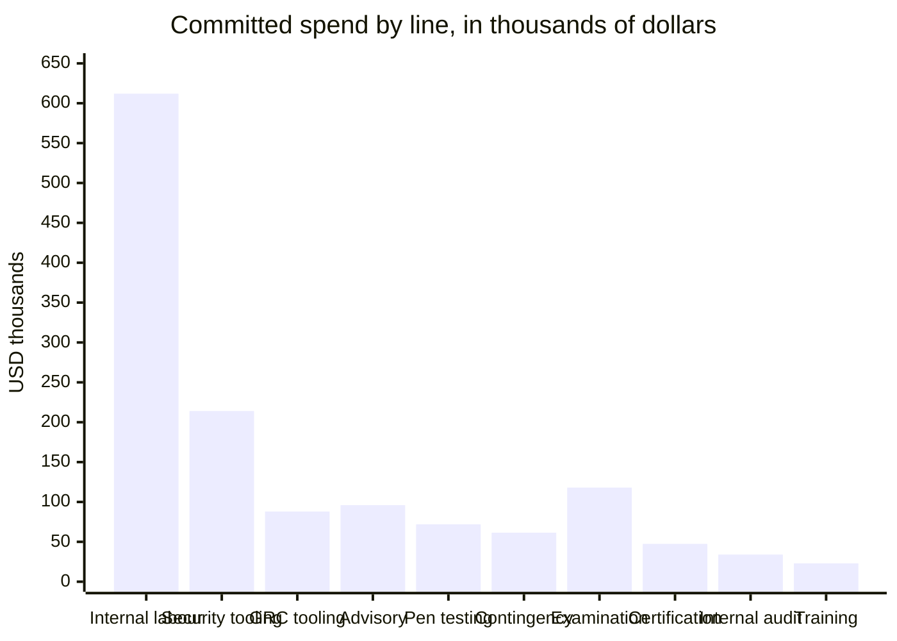

# 📊 Executive Dashboard — CloudNimbus SOC 2 Type II and ISO/IEC 27001:2022 Programme

> **This page renders directly on GitHub** — the charts below are [Mermaid](https://github.blog/2022-02-14-include-diagrams-markdown-files-mermaid/) diagrams that GitHub draws inline, so the dashboard is visible with no setup.
> For the fully interactive version, open [`index.html`](index.html) locally. It also works under **GitHub Pages** published from the **repository root**, not from `/docs` — its links into the phase folders resolve one level above itself.
>
> *Illustrative portfolio sample · "Confidential — Trust and Assurance Programme" formatting for realism only · all names and figures fictional.*

---

## Programme scorecard

| Dimension | Result | Status |
|---|---|:--:|
| **Entity** | CloudNimbus, Inc. · B2B SaaS workforce platform · 187 staff, remote-first · 640 customers · ~1.24M end users · $38.4M ARR | 🟢 |
| **SOC 2 scope** | **Type II across all five categories** — Security, Availability, Processing Integrity, Confidentiality, Privacy · **61 applicable criteria** · window **2026-07-01 → 2026-12-31** | 🟢 |
| **SOC 2 outcome** | **Unmodified opinion**, report issued **2027-02-26** · **9 test exceptions disclosed in Section IV** | 🟡 |
| **The near-modification** | The service auditor **considered modifying the opinion** over exception 5 and concluded not to. **The reasoning is reproduced, including the parts that point the other way** | 🔴 |
| **ISO scope** | **ISO/IEC 27001:2022 incl. Amd 1:2024** · ISMS boundary is **the whole organisation**, not carved to engineering | 🟢 |
| **ISO outcome** | **Certificate issued 2027-01-22** by Northgate Certification Services, Ltd. under **ANAB** accreditation · valid to **2030-01-21** | 🟢 |
| **Stage 2 findings** | **1 major nonconformity · 4 minor · 7 opportunities for improvement** — the major closed in **44 days** | 🔴 |
| **Where the major came from** | **CloudNimbus's own records, eleven months earlier.** Read, agreed with, **minuted at the highest governance body in the ISMS and deferred twice** | 🔴 |
| **Who found the exceptions** | **CloudNimbus did — all nine, before the service auditor did.** Stated once and **not celebrated**: it is what a working programme looks like rather than an achievement, and on one of the nine the programme found the failure only because somebody was assembling a sample for the examination | 🟡 |
| **Statement of Applicability** | **93 Annex A controls · 91 necessary · 2 not necessary** · **4 exclusions argued for and refused** | 🟢 |
| **Control library** | **150 controls · 113 dual-serving · 21 SOC 2-only · 16 ISO-only** · 19 policies · 24 evidence classes | 🟢 |
| **Risk register** | 38 entries · baseline 36 (7 High) → close **0 High · 17 Moderate · 21 Low** · **2 added on evidence, none closed** | 🟡 |
| **Against the published forecast** | Forecast **0 · 16 · 22** · actual **0 · 17 · 21** — one entry at band level, **five entries crossing a band underneath it, eleven ratings diverging** | 🟡 |
| **Objectives** | **7 of 8 met.** **OBJ-03 — the integration objective the programme was designed around — missed at 16.9% against 70%** | 🔴 |
| **The charter's own success test** | Four measurable criteria set in January 2026 and **never scored until the close-out**. Scored: **3 met, 1 not met** | 🔴 |
| **Open at close** | **16 corrective actions open · 17 issues open · 5 minor nonconformities open** — Stage 2's four, plus the correction audit's **clause 7.4 minor**, recorded separately rather than folded into the four. Nothing closed to tidy the close-out | 🟡 |
| **Cost** | **$1,366,000** of a $1,400,000 envelope over ~14 months · **4.6 FTE** · internal labour $612,000 exceeds every external fee combined | 🟢 |
| **Adversarial review** | **338 defects found and fixed** across the eight phases issued before the last — 19, 29, 26, 33, 34, 74, 77, 46 | 🟡 |

**The five red lines are the honest headlines.** The programme's worst finding was a decision rather than a detection failure; Stage 2 produced a major nonconformity at all; the opinion came close to being modified; the integration objective missed by a factor of four; and the charter's own definition of success went unmarked for fourteen months until a reader outside the programme asked why.

---

## The nine-phase journey

---

## Two deliverables, and the thing they are not

**SOC 2 assesses controls against criteria. ISO 27001 certifies a management system.** You can hold a valid certificate with Annex A controls excluded; you cannot pass an examination with a trust services criterion unaddressed. **That asymmetry drove the whole integration design** — and **there is no SOC 2 certification**, because an examination produces an opinion. **ISO does not certify anyone** either; an accredited certification body does.

---

## The nine test exceptions, as published in Section IV

| # | Criterion | Control | Population | Deviations | Rate |
|---|---|---|---|---|---|
| 1 | **A1.2** | `CNB-C-098` | 6 monthly restore tests | 1 | **16.7%** |
| 2 | **A1.1, A1.2** | `CNB-C-096` | 1 event | 1 | **—** |
| 3 | **PI1.3** | `CNB-C-108` | 58 reconciliation exceptions | 2 | **3.4%** |
| 4 | **CC8.1** | `CNB-C-082` | 15 emergency changes | 2 | **13.3%** |
| 5 | **P4.2** | `CNB-C-126`, `CNB-C-127` | 184 nights of RT-02 in `eu-central-1` | 68 | **37.0%** |
| 6 | **CC9.2** | `CNB-C-092` | 24 quarterly Tier 1 readings | 2 | **8.3%** |
| 7 | **P5.1** | `CNB-C-129` | 58 data subject requests | 1 | **1.7%** |
| 8 | **CC6.2** | `CNB-C-037` | 40 provisioning requests | 2 | **5.0%** |
| 9 | **CC6.3** | `CNB-C-040` | 47 revocations arising | 3 | **6.4%** |

**Exception 2 is absent from the chart because it carries a dash rather than a rate, and the dash is the finding.** `CNB-C-096`'s synthetic probe performed a read, so through seventy-one minutes in which reads succeeded and writes failed, **every word of the control was satisfied** and no burn registered against the error budget. **A design deficiency has an event, not a rate**, and expressing it as one-in-something would invite a reader to divide it into insignificance.

**Exception 5's 37.0% is the honest denominator, not the flattering one.** The whole scheduled-deletion population is 8 rules × 3 regions × 184 nights = **4,416 rule-nights**, against which the same sixty-eight nights read as **1.5%**. Both are printed, and [09.05 §2](../09-executive-reporting-and-continuous-assurance/09.05-the-near-modification-resolved.md) says which one this programme thinks is honest and why.

> **Nine of the sixty-one applicable criteria carry the nine exceptions. Fifty-two carry none — and that is not fifty-two successes.** Several are served by controls with a population of one.

---

## Why the opinion was not modified, and how close it was

**"Clean opinion" is not a term the standards use.** Test exceptions are disclosed in Section IV and do **not** automatically modify an opinion; the practitioner modifies only where the deviations mean the applicable criteria were not achieved. **This portfolio publishes the reasoning rather than the conclusion**, because a portfolio that showed the outcome alone would teach a reader that unmodified opinions simply happen.

---

## The risk register — flat for five phases, then nineteen entries at once

*Three lines: **High** (7 → 0), **Moderate** (17 → 17), **Low** (12 → 21).*

| Position | High | Moderate | Low | Total | What moved |
|---|:--:|:--:|:--:|:--:|---|
| **Baseline, 2026-04-10** | 7 | 17 | 12 | **36** | R-01 to R-36 published with the scoring model |
| **After R-37, 2026-05-22** | 8 | 17 | 12 | **37** | Admitted on penetration test evidence at 4 × 5 = 20 |
| **June review, 2026-06-15** | 7 | 18 | 12 | **37** | R-37 alone — on a retest, the only entry ever carried out of High that way |
| **September review, 2026-09-29** | 8 | 17 | 12 | **37** | **Six reductions proposed, none accepted.** R-08 raised 12 → 15 on nine occurrences in ninety-two days |
| **After R-38 and R-24, October** | 8 | 18 | 12 | **38** | R-38 admitted at 3 × 4 = 12; **R-24 re-rated upward** 8 → 12, its described event having occurred |
| **December review, 2026-12-29** | **0** | **17** | **21** | **38** | **Nineteen entries moved, seven held** — the first review with a closed window behind it |
| **March review, 2027-03-09** | 0 | 17 | 21 | **38** | Held unchanged. Q4 events have at most three months behind them |

**The scoring discipline, stated once and applied everywhere:** likelihood (1–5) × impact (1–5), **High ≥ 15 · Moderate 8–12 · Low ≤ 6**. **A rating moves on likelihood unless the consequence itself changed. Likelihood 1 is reserved for the not-reasonably-foreseeable — so an entry at 3 × 4 reaches 2 × 4 = 8 and stops. Eight is a floor.**

**And a floor is downward only.** **R-24 sat on it and then went up**, from 2 × 4 = 8 to 3 × 4 = 12, when the event it describes occurred. **Nothing closed. Nothing was removed. A risk that stops being likely is re-rated, not deleted.**

---

## The forecast against the actual — one entry at the top, five underneath

| Entry | Forecast | Actual | Direction |
|---|---|---|---|
| **R-08** | 2 × 3 = 6, Low | **3 × 3 = 9, Moderate** | ▲ worse than forecast |
| **R-09** | 2 × 3 = 6, Low | **4 × 3 = 12, Moderate** | ▲ worse — **its described event occurred**, and the entry did not move at all |
| **R-18** | 2 × 3 = 6, Low | **3 × 3 = 9, Moderate** | ▲ worse — its described event occurred on 2026-09-08 |
| **R-13** | 3 × 3 = 9, Moderate | **2 × 3 = 6, Low** | ▼ better — the control changed and the window tested it |
| **R-14** | 3 × 3 = 9, Moderate | **2 × 3 = 6, Low** | ▼ better — recorded as the weakest of the nineteen movements |

**Three up, two down, net one.** 16 + 3 − 2 = 17; 22 − 3 + 2 = 21.

> **A forecast that is right at the band level and wrong five times underneath it is not a good forecast that got lucky, and it is not a bad one. It is a forecast whose aggregate absorbed its errors.** The total absorbed four of the five and showed the fifth — and the one it showed is not more important than the four it hid; it is just the one that did not have a partner. **A programme that checked only the aggregate would have declared the forecast a success and learned nothing from the five.**

---

## The programme against its eight objectives

| ID | Target | Actual | Verdict |
|---|---|---|:--:|
| OBJ-01 | Unmodified opinion, form of opinion in Section I | Unmodified, 2027-02-26 | 🟢 **Met** |
| OBJ-02 | ISO/IEC 27001:2022 certificate issued by 2027-01-31 | Issued 2027-01-22 | 🟢 **Met** |
| **OBJ-03** | **≥ 70% of evidence artefacts serving both deliverables** | **16.9% — 356 of 2,103** | 🔴 **Missed** |
| OBJ-04 | ML-1, ML-2 and ML-3 closed and verified by 2026-06-30 | 3 of 3 closed and verified | 🟢 **Met** |
| OBJ-05 | Mean questionnaire turnaround from 11.4 days to ≤ 3.0 | 2.6 days across 47 questionnaires | 🟢 **Met** |
| OBJ-06 | Register maintained; quarterly cadence, no lapse | Five CAL-06 occurrences, no lapse | 🟢 **Met** |
| OBJ-07 | Committed spend ≤ $1,400,000 | $1,366,000 | 🟢 **Met** |
| OBJ-08 | Awareness training completion ≥ 95% of 187 staff | 96.8% — 181 of 187 | 🟢 **Met** |

**Seven met, one missed — and the miss is reported first, before the explanation.** The explanation is then a second finding rather than an excuse: **the measure was wrong.** Most evidence is framework-specific and always will be — a clause 9.2 audit plan is not an examination artefact and a Section IV test population is not an ISO one. **The integration dividend was never in the artefacts. It is in the controls: 113 of 150 serve both frameworks, 75.3%, clearing the bar on the measure the objective should have used.**

**That better measure is published and is not substituted**, because *a programme that changes a measure in the document that scores it has scored itself.*

**And every one of the seven green rows cost or concealed something.** OBJ-01 measures what an independent party concluded, not what CloudNimbus delivered — **the charter said in January it should never have been written as a target**. OBJ-02's nine days of margin absorbed a major nonconformity, so **it was not margin**. **OBJ-04 is the one the close-out says it would keep if it could keep one**: all three 2025 management letter points were closed and verified on time, and **eighteen months later ML-1's subject matter produced exception 9 and ML-2's produced exception 4** — *remediating a control is not the same as remediating the evidence trail it leaves behind*. OBJ-05 was measured **in the first quarter in which a report existed**, so part of it is a measure of the arrival. OBJ-06 measures that the review happened and **not what the review did**. OBJ-07's $34,000 of headroom is **2.4% and smaller than the contingency line alone** — a rounding error rather than a saving. OBJ-08's 96.8% **was the practical ceiling**, so the same number would have come back either way.

---

## The charter's own success test, scored fourteen months late

| # | The criterion, as the charter set it | Verdict |
|---|---|:--:|
| 1 | A Type II report exists across all five categories for the full window, handed to a customer under non-disclosure **without a covering explanation** | 🟢 **Met**, with the second limb argued rather than settled |
| 2 | An ISO/IEC 27001:2022 certificate exists, whole organisation, accredited body, **no open major nonconformity** | 🟢 **Met** — four **minor** nonconformities are open and the criterion did not ask |
| 3 | Evidence **produced once and used twice, at or above the 70% threshold** | 🔴 **Not met — 16.9%** |
| 4 | Questionnaire turnaround from 11.4 days to three or fewer | 🟢 **Met**, on OBJ-05's caveat |

> **A close-out that reports seven of eight objectives met while leaving the charter's own success test unscored has chosen the flattering instrument.** Both instruments were available; only one was used, and **the choice was not made deliberately, which is worse rather than better.** It went unscored because nothing required it to be scored — **no control in the library asks whether a charter's success criteria have been marked at close.**

The charter also set a fifth criterion it called unmeasurable — that the programme's own account of what happened is accurate. **It still cannot be measured**, and the close-out says so rather than claiming it.

---

## The four failures, and what each taught

| Failure | The shape of it | The lesson |
|---|---|---|
| **RT-02** — 68 consecutive nights | A control whose operating condition is that **a record was written**, rather than what the record says. Success and non-existence produced the same observable state | **A completion record nobody reads is a log, not a control.** `IS-33` still owes a number: the library has not been enumerated for controls with that shape |
| **`CNB-C-096`** — the availability probe | A control that says **how often** and never says **what**. The probe performed a read; through 71 minutes in which writes failed, every word of it was satisfied | **Detection worked; measurement did not.** `CNB-C-068` beside it *was* explicit — so the silence is a design deficiency, not an inevitability |
| **The missed restore test** | The August occurrence did not happen. It was not re-performed and back-dated; the deviation stands at 1 of 6 | **A correction that fixes the instances is not a corrective action**, and clause 10.2 distinguishes them in words. **An occurrence is an event on a date** |
| **The major nonconformity** | The control library got ahead of the practice it described. The audit programme document was written in January; the control describing it was written in June; **both were correct on their own face and nothing compared them** | **Reading the library told nobody anything was wrong.** `IS-35` records the class rather than the instance — it can exist anywhere in 150 rows and has not been enumerated |

---

## Where the findings came from — four registers, three vocabularies, twenty weeks

**Four of Northgate's five findings were already in CloudNimbus's own records** — one was the internal auditor's, one was Phase 06's open issue, one was the internal auditor's partially closed, and one was Phase 07's own deviation. **The fifth, the major, was not in the records as a finding. It was in them as a decision.**

---

## Independent testing and the operating record

| Activity | Result |
|---|---|
| **Penetration testing, 2026-05-04 → 05-22** | **16 findings — 1 Critical, 3 High, 6 Medium, 6 Low.** The Critical was a **tenant isolation flaw**: a crafted identifier inside a nested filter bypassed the row-level security predicate and returned another tenant's aggregate compensation totals. Remediated 2026-05-29, **retested clean 2026-06-11 — before the window opened** |
| **What the log search could not do** | **Nine months of a twenty-two-month exposure were unexaminable.** That is stated rather than replaced with "no evidence of access" |
| **DR exercise, 2026-08-19** | `us-east-1` → `us-west-2`. **RTO 2h 51m against 4h · RPO 4m 12s against 15m.** Six findings, one material. **`eu-central-1` deliberately not failed over** — an obligation forbids cross-region recovery, and the residual is accepted rather than engineered away |
| **Availability, measured per region, month by month** | `us-east-1` July **99.98%** · August **99.97%** · September **99.84%** · October **99.96%** · November **99.95%** · December **99.94%**. `eu-central-1` **100%** in all six. **SC-01 was met for the 41 EU-residency customers and missed for the 599 served from `us-east-1` in September** — a blended platform figure would have concealed that, and **a mean is not the test**, which is why six monthly figures are printed and the six-month mean is named as a number the contract does not contain |
| **The Severity-1, 2026-09-08** | **71 minutes.** The writer instance stopped accepting writes; failover completed at the data layer in **47 seconds**. Connection pools held connections to the demoted instance because the health check tested **reachability, not writability**. **Reads succeeded, writes failed.** 41,208 failed writes across 318 tenants; **no data loss and the RPO was never engaged** |
| **Processing integrity, Q3** | **92 nightly cycles · 26 reconciliation exceptions, 25 cleared inside the service level · 5,171 payroll export files, 0 rejected · 101,447,318 records submitted** |
| **Second penetration test, 2026-10-05 → 10-16** | Commissioned **inside** the observation window, knowing what a finding would cost — and it cost. **9 findings: 0 Critical, 1 High, 3 Medium, 5 Low.** The High sat in the payroll export path: a signed URL stayed valid for its full twenty-four hours after the file behind it had been re-issued. **Five of the nine carry a documented retest; the four remaining Lows do not, at this vantage** |

---

## Cost, and where it actually went

**$1,366,000 committed against a $1,400,000 envelope** over roughly fourteen months, at **4.6 FTE-equivalents** in a 187-person organisation.

**The headroom is $34,000 — 2.4%, a rounding error rather than a saving**, and smaller than the contingency line alone. **The interesting number is that internal labour at $612,000 is larger than every external fee combined.** The outsourced ISMS internal audit is also $34,000 — **the same figure as the headroom, by coincidence rather than construction**, which is why the close-out names the line and the firm rather than the amount alone.

**No fine or penalty amount appears anywhere in this repository.** Every figure above is a cost of assurance.

---

## What none of this claims

**Not that CloudNimbus is secure.** Neither instrument measures it. One is a conformity assessment of a management system at the **opening** of a three-year cycle; the other is a practitioner's opinion on specified controls **throughout a period that has ended**.

**Not that the controls will operate in 2027.** The 2027 window was ten weeks old at the close-out, the surveillance audit was eight months away, and the strongest thing anyone could say is that the calendar exists and the controls have owners.

**Not that a clean report predicts anything.** The evidence is inside the report itself — **the retention job addressed an emptied relation for sixty-eight nights, eleven weeks before the period ended, in the period an unmodified opinion was expressed on**, and nothing in the control library detected it.

**Not that the programme found everything**, and **not that any of this is a determination of compliance with any law** — not the GDPR, not the CCPA or CPRA, not any state privacy statute.

---

*Illustrative portfolio sample. All names, figures and findings are fictional. **A SOC 2 examination produces an opinion and never a certificate**, and the report is a **restricted-use** document. **ISO does not certify anyone**; accredited certification bodies do. No fine or penalty amount is stated anywhere in this repository.*

← [Back to the repository README](../README.md)
